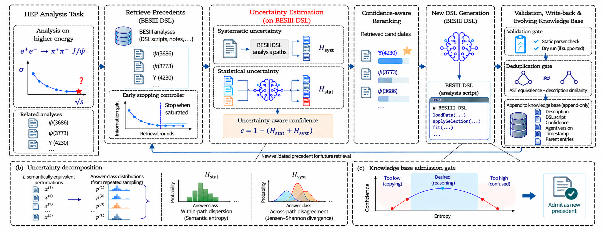

# HepUKE — uncertainty-aware knowledge evolution for HEP analysis agents



An uncertainty-aware RAG system for technical analysis corpora. Three things it does beyond a standard retrieve-then-generate pipeline:

- **Scores precedents by generation uncertainty, not relevance alone.** Each candidate is evaluated by the reduction in token-level uncertainty when generating a BESIII DSL program. Selection-focused entropy provides a stronger signal than full-code entropy for identifying useful precedents.

- **Stops retrieval when additional rounds provide little information.** A controller combines backward stationarity detection with a forward estimate of marginal information gain. On BESIII PhysicsQA, it reduces retrieval rounds by 43.0% and prompt tokens by 44.9%, with a 2.27-point accuracy decrease; on HotpotQA, it reduces runtime by 18.2% with a 0.76-point F1 decrease.

- **Evolves the knowledge base through confidence-gated write-back.** Generated DSL programs are admitted only after structural validation and uncertainty-based gating. An interval gate rejects both conflicting generations and overconfident transcription of unsuitable precedent-specific details.

The repository includes the BESIII DSL corpus and a 1,000-question BESIII PhysicsQA benchmark. The retrieval controller is also evaluated on HotpotQA, while the confidence estimator and knowledge-evolution components are designed for structured HEP analysis specifications.


**You supply:** a Milvus 2.x instance and an OpenAI-compatible chat endpoint.
No keys, endpoints, model weights or hosted indexes are included.

---

## Install

```bash
pip install -e .                   # add [gpu] for the local BGE-M3 embedder
cp config.example.yaml config.yaml
cp .env.example .env               # fill in MILVUS_URI, LLM_BASE_URL, LLM_API_KEY, LLM_MODEL

python scripts/check_setup.py --live
```

`check_setup.py` verifies packages, config, data and endpoints, and prints the
command to fix anything missing. Python ≥3.10.

## Use it on your own documents

```bash
# 1. index a directory of markdown
hepuke ingest --root /path/to/docs --collection mydocs

# 2. search it
hepuke search "how is the trigger efficiency measured" --collection mydocs

# 3. ask the agent — it plans, searches, and answers
hepuke ask "which datasets were used and why those energies" --collection mydocs
```

As a library:

```python
from hepuke import HepUKE, Document, load_config

rag = HepUKE(load_config())
rag.create_collection("mydocs")
rag.connect_collection("mydocs")

rag.insert(Document(text="...", doc_id="note-1",
                    metadata={"section_type": "results"}), split_chunk=True)

hits = rag.retrieve("trigger efficiency", similarity_top_k=5)   # hybrid + rerank
answer = rag.query("trigger efficiency")                        # retrieve + generate
```

As a service:

```bash
hepuke serve                       # FastAPI on config.service.port
curl -s localhost:42796/apiv2/agent/ask \
     -H 'content-type: application/json' \
     -d '{"question": "...", "collection": "mydocs"}'
```

Other endpoints: `/apiv2/health`, `/apiv2/agent/chat`,
`/apiv2/{collection}/retrieve`, `/apiv2/{collection}/query`,
`/apiv2/collections`. Full list at `/docs` once the server is up.

CLI reference: `hepuke {ingest,search,grep,read,ask,serve,collections,bench,trace}`.

## Turning on the early-stopping controller

Off by default, because it needs two small fitted checkpoints that are not
shipped. To fit your own on HotpotQA:

```bash
curl -L -o data/hotpot_dev_distractor_v1.json \
  https://hotpotqa.github.io/data/hotpot_dev_distractor_v1.json

python scripts/collect_hotpotqa_trajectories.py \
       --hotpot-json data/hotpot_dev_distractor_v1.json \
       --out storage/predictor_train/trajectories.jsonl
python scripts/train_predictor.py    --data storage/predictor_train/trajectories.jsonl \
                                     --out storage/predictor.pkl --seed 0
python scripts/grid_search_fusion.py --data storage/predictor_train/trajectories.jsonl \
                                     --hotpot-json data/hotpot_dev_distractor_v1.json \
                                     --predictor storage/predictor.pkl \
                                     --out storage/fusion.pkl --tolerance 0.02
```

Then in `config.yaml` set `confidence.enabled: true` and point
`predictor_ckpt` / `fusion_ckpt` at the two files. Re-run the grid search on
your own corpus rather than keeping the shipped `z_star` — the operating point
does not transfer across domains.

Collecting trajectories costs real API calls; start small with `--n 200`,
and use `--workers` / `--auto-resume` for the full run.

## What comes with it

| | |
|---|---|
| `data/besiii_physicsqa/` | 1,000 QA pairs over BESIII analyses, each declaring its scorer (`exact` / `numeric` / `set_f1`) and gold evidence hashes. Datasheet in its README. |
| `data/corpus/` | 700 analyses × (reference DSL program, task description, model regeneration). This is the knowledge base the DSL experiments retrieve over. |
| `data/besiii_dsl_index/` | The chunked index the QA gold resolves against. Source-paper text is withheld for licensing reasons; ids in `arxiv_ids.txt`. |

Scoring: `scripts/besiii_set_scorer.py` (BESIII, by scorer type),
`scripts/hotpot_score.py` (official HotpotQA Ans/Sup EM+F1),
`scripts/paired_analysis.py` (paired bootstrap + Wilcoxon).

Grade the QA set per `scorer` field — the four families are not
interchangeable. Two known issues are listed in
`data/besiii_physicsqa/README.md`.

## Reproducing the paper's experiments

The research pipeline lives in `token_conf/`. Build the derived inputs first
(offline, no API calls):

```bash
python token_conf/dsl_gate/splits.py
python scripts/index_besiii_dsl_blocks_v1.py --dry-run --allow-unresolved-gold
```

Everything else is in `token_conf/dsl_gate/`. Only `generate_*` and `judge_*`
cost API calls; the rest is analysis over their output.

```
splits ─→ build_index ─→ generate_candidates ─┬─→ runs_gate/all.jsonl
                         generate_baseline  ──┘          │
                                                         ├─→ strategy_matrix ─→ figures/plot_ablation
                                                         ├─→ sweet_spot
                                                         ├─→ three_tier_tables
                                                         ├─→ kb_evolution ─┬─→ interval_gate
                                                         │                 └─→ figures/plot_calibration
                                                         └─→ bootstrap
                      judge_phys_acc ─→ judgments.jsonl ─┘   (paired CIs)

build_paraphrases ─→ run_perturbations ─→ judge_perturbations ─→ summarize_perturbations
                     (variants: k10, para — see variants.py)
```

`generate_candidates` is the expensive step — N samples per target. Start with
`--split dev --limit 20`.

Each script's `--help` documents its flags; a script whose upstream stage has
not run names the command that produces its input. `figures/` holds the two
scripts whose output is a plot — everything else prints tables.

Two caveats if you are comparing against the published numbers: this release
carries 700 of the 868 analyses the paper indexed, so retrieval ranking
differs; and `splits.py` builds its own seed-42 partition rather than the
paper's. Absolute scores are also model-dependent — every script defaults to
the model identifier frozen in the paper and takes an override via
`$DSL_MODEL`, then `llm.model` in `config.yaml`.

## Licence

Code MIT (`LICENSE`). Data CC BY 4.0 (`data/LICENSE-DATA.md`).
